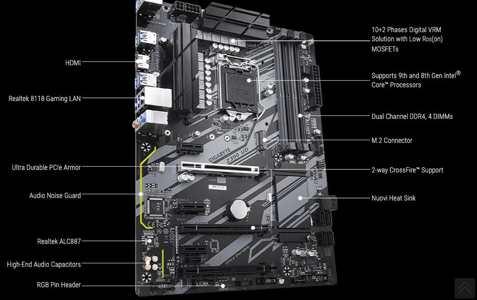
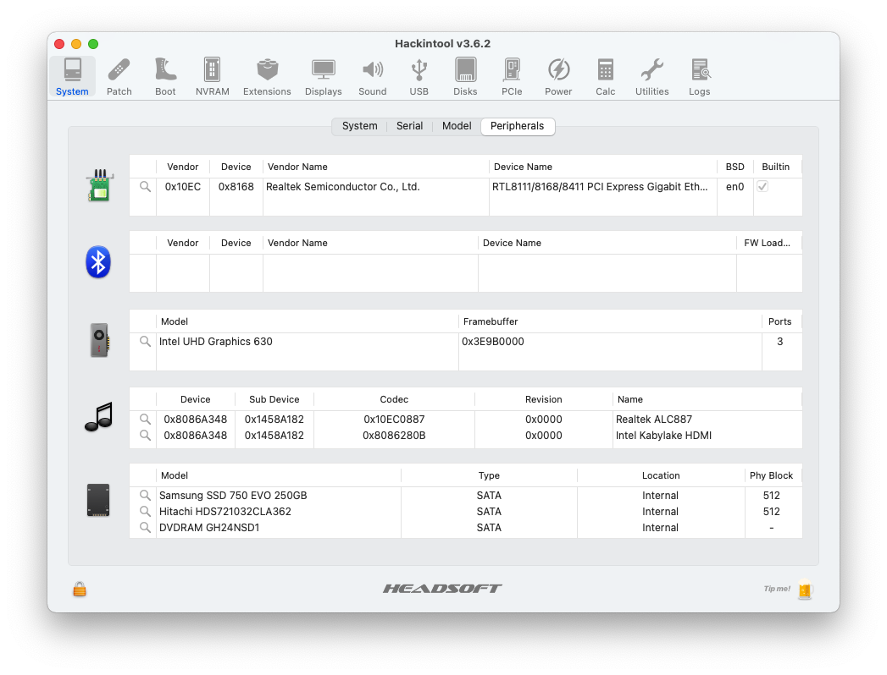
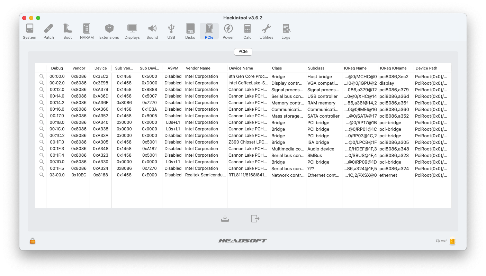
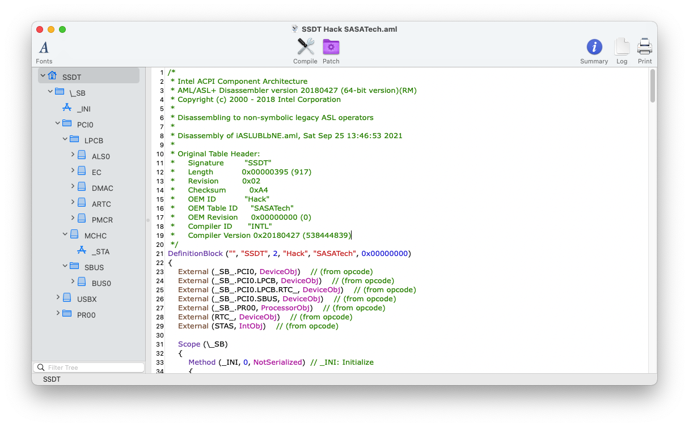

# Gigabyte-Z390-UD-Hackintosh

## macOS Big Sur/Monterey correttamente installato su Gigabyte Z390 UD
# Italian Repository

# Specifiche:

| Componenti       | Modello                            |
| ---------------- | ---------------------------------- |
| Scheda Madre     | Gigabyte Z390 UD (BIOS 10K)        | 
| CPU              | Intel i5 9400                      | 
| iGPU             | Intel® UHD Graphics 630            |
| Audio            | Realtek ALC887                     |
| RAM              | 16 Gb DDR4 3200 Mhz                |
| SSD              | Samsung 750 Evo 250gb              |
| SMBIOS           | iMac19,1                           |
| Bootloader       | OpenCore 0.7.3                     |

## Di default la GUI di OC è impostata in 1920x1080.
Se avete una risoluzione diversa, recatevi in EFI > OC, cancellate la cartella Resources e scompattate quella che vi interessa.

## Se volete installare la Beta 7 di macOS Monterey:
Vi lascio il config.plist rinominato in configbeta7.plist pronto da utilizzare SOLO per scaricare ed installare l'aggiornamento.
Al termine dell'aggiornamento dovete cancellarlo e rimettere l'originale config.plist.
È consigliabile scollegare l'Hackintosh dall'ID Apple prima di sostituire momentaneamente il config.plist

## NOTE:
Kexts aggiornati alle ultime versioni eccetto USBInjectAll (provvisorio dato che manca mappatura USB) e RealtekRTL8111 che nella versione 2.4.2 dava problemi di instabilità alla connessione LAN almeno nel mio caso.

# Impostazioni Bios

## Disabilita:

- Fast Boot
- VT-d
- CSM
- Intel SGX
- Intel Platform Trust
- CFG Lock (MSR 0xE2 write protection)

## Abilita:

- Intel Virtualizzation Technology
- Above 4G decoding
- Hyper-Threading
- Execute Disable Bit
- EHCI/XHCI Hand-off
- OS type: (Windows 10 Feautres: Windows 8/10 WHQL oppure Other)
- DVMT Pre-Allocated(iGPU Memory): 64 MB
- DVMT Total Gfx Mem → MAX

## Impostazioni generiche, potresti non trovarne alcune.
  
# Dispositivo Screenshot

# Cosa funziona e cosa no:
- [x] Intel UHD 630 iGPU
- [x] ALC887 Uscite interne
- [x] ALC887 HDMI Audio Output
- [x] Porte USB (Funzionano ma richiedono mappatura)
- [x] Realtek 8118 Gaming LAN
- [x] NVRAM
- [x] Avvio Windows da OpenCore

# Sezione Info SSDT Gigabyte Z390 UD

## Crediti

- [Acidanthera](https://github.com/acidanthera) per OpenCore Bootloader
- [Apple](https://apple.com) per macOS;
- [HackintoshLifeIT](https://github.com/Hackintoshlifeit) Gruppo di supporto Pre e Post Installazione
- [Baio1977](https://github.com/Baio1977)
- [Lorys89](https://github.com/Lorys89)
- [Dortania](https://github.com/dortania)
- [Daliansky](https://github.com/daliansky)
- [Rehabman](https://github.com/RehabMan)

# Se avete bisogno di aiuto contattateci su [Telegram](https://t.me/HackintoshLife_it)
